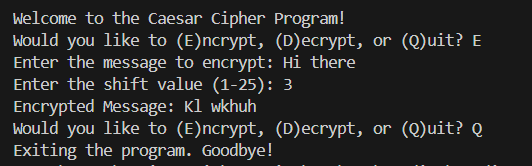
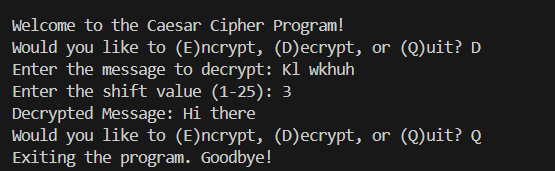

# PRODIGY_CS_01 - Caesar Cipher Encryption and Decryption
This repository contains a Python program that implements the Caesar Cipher algorithm for encrypting and decrypting text. Users can input a message and a shift value to perform either encryption or decryption. This project demonstrates fundamental cryptography concepts and is part of Cyber Security Task 01 for the Prodigy InfoTech Internship.

The Caesar Cipher is a classic encryption technique where each letter in the plaintext is shifted by a fixed number of positions either up or down the alphabet. The program provides an interactive interface that allows users to input a message and a shift value to perform encryption or decryption based on their needs.

---
### Key Features:
- **Encryption**: Converts a plaintext message into ciphertext by shifting each letter.
- **Decryption**: Reverses the encryption process to recover the original message.
- **User Input**: The program accepts a message and a shift value as input, allowing flexible encryption and decryption operations.

## Screenshots

### Encryption and Decryption Example:- The process of encrypting and decrypting a message.

    
    

## Video Tutorial
Click below to watch a tutorial:
## Video Tutorial

<video width="100%" controls>
  <source src="[Overview.mp4](https://github.com/amnandan9/PRODIGY_CS_01/blob/main/Overview.mp4)" type="video/mp4">
  Your browser does not support the video tag.
</video>
https://github.com/amnandan9/PRODIGY_CS_01/blob/main/Overview.mp4
